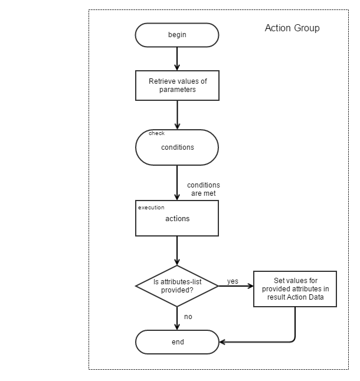

Action Groups
=============

 * [What are the Action Groups?](#what-are-the-action-groups)
 * [ActionGroup Configuration](#actiongroup-configuration)
 * [Data isolation](#data-isolation)
 * [Call from PHP](#call-from-php)
 * [Recommendations](#recommendations)
 * [Using result of action group](#using-result-of-action-group)
 * [Action Group Diagram](#action-group-diagram)


What are the Action Groups?
---------------------------
Action Group is a named block of execution logic bunched together under its own `actions` configuration node.
*Action groups* can be called with `@run_action_group` action in any application configuration nodes which supports
Action Component.
*Action group* declaration also has important configuration section - `parameters` that describes all expected 
data from the caller (with type, requirement, default value, and validation message).
Parameters will be accessible in actions as the root node of contextual data (e.g `$.parameterName`).
Also, along with `parameters` and `actions`, there can be optionally declared special `acl_resource` criteria and
custom `conditions` node, where you can define special instructions to check against, before bunch execution process.

ActionGroup Configuration
-------------------------

File `<bundleResourceRoot>/config/oro/action.yml`

```
action_groups:                                  # root node for action groups
    demo_flash_greetings_to:                    # name of action group
        parameters:                             # parameters declaration node
            what:                               # name of parameter
                type: AcmeBundle/String/Phrase  # (optional, default = any) type validation of parameter (available types: integer, string, boolean, array, double, object, PHP class)
                message: "Bad type"             # (optional) message to be prompted if parameter validation failure met
                default: "Hello"                # (optional) default value for optional parameter, if not set then parameter `what` is required
            who: ~                              # set all defaults to parameter options (type: any)
        conditions:                             # Condition expression
            @not_empty: [$.who]
        actions:                                # list of actions that should be executed
            - @call_service_method:
                service: type_guesser
                method: guess
                method_parameters: [$.who]      # as you can see, parameters are accessible from root $.<parameterName>
                attribute: $.typeOfWho
            - @flash_message:
                message: "%param1%, %param2%!"
                type: 'info'
                message_parameters:
                    param1: $.what
                    param2: $.typeOfWho
```

Now we can run this action_group with something like:

```
    @run_action_group:
        action_group: demo_flash_greetings_to
        parameters_mapping:
            who: $.myInstanceWithVariousType
```
Here we skip `what` parameter, as it has default value `default` and it is good for us.
To see syntax of `@run_action_group` see [the actions section](./actions.md#run-action-group-run_action_group)


Data isolation
--------------

Note that **Action group** runs (executes) with clean context data. E.g. caller context will be mapped with `parameters_mapping` 
(under `@run_action_group`) to a new context and **action group** will be executed with it.
There will be no data except for those that supported by **action group** parameters declaration.
That is why **action groups** can be called from different places and with various cases.

Call from PHP
-------------

All named action groups internally gathered under registry service `oro_action.action_group_registry`, which is the
instance of [`\Oro\Bundle\ActionBundle\Model\ActionGroupRegistry`](../../Model/ActionGroupRegistry.php) class. 
It has simple api to `get` **action group** ([`\Oro\Bundle\ActionBundle\Model\ActionGroup`](../../Model/ActionGroup.php)) 
configured instance and perform its execution by invocation of `\Oro\Bundle\ActionBundle\Model\ActionGroup::execute` method wth proper params.


Recommendations
---------------

**User Interface** 
In example above we've use in `actions` block action called `@flash_message`. That action was mentioned only for 
example purpose.
Usually you should not perform any user interface related actions in **action group** `actions` set. Because they can 
be called or used in scope of actions that have no available user interface environment in runtime. 

Using result of action group
----------------------------
As for a most actions that implements [`ActionInterface`](/src/Oro/Component/Action/Action/ActionInterface.php) all 
result is stored under its execution context object. Usually it is one of 
[`AbstractStorage`](/src/Oro/Component/Action/Model/AbstractStorage.php) child instances.
So all results of action group as of action can be accessed from context data passed to its method `execute(...)` method.

Here we bring two useful `@run_action_group` configuration options: `results` (to map (transfer) data from action group 
context to caller context separately ) and `result` to put all context of executed action group under desired node of caller context.
[More information about `@run_action_group` options](./actions.md#run-action-group-run_action_group).

Action Group Diagram
--------------------
Following diagram shows action group processes logic in graphical representation: 